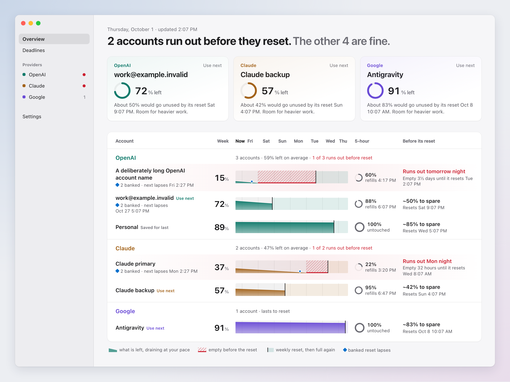
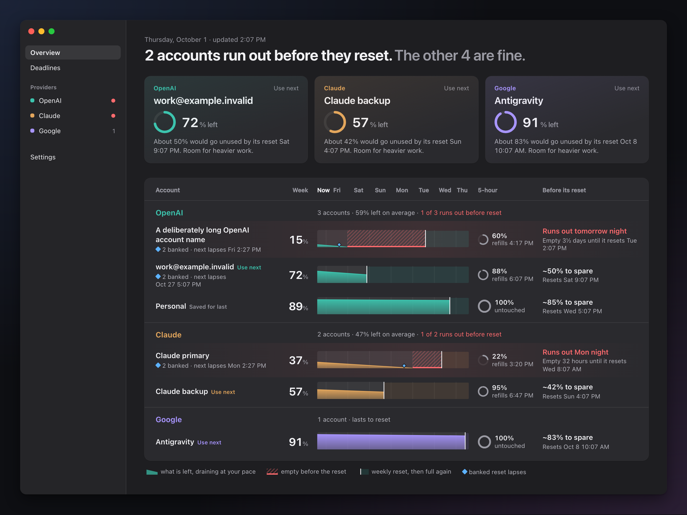
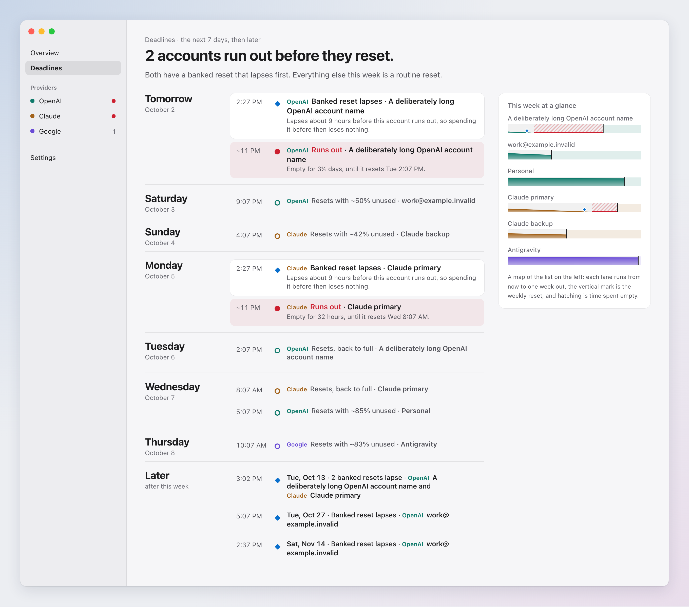
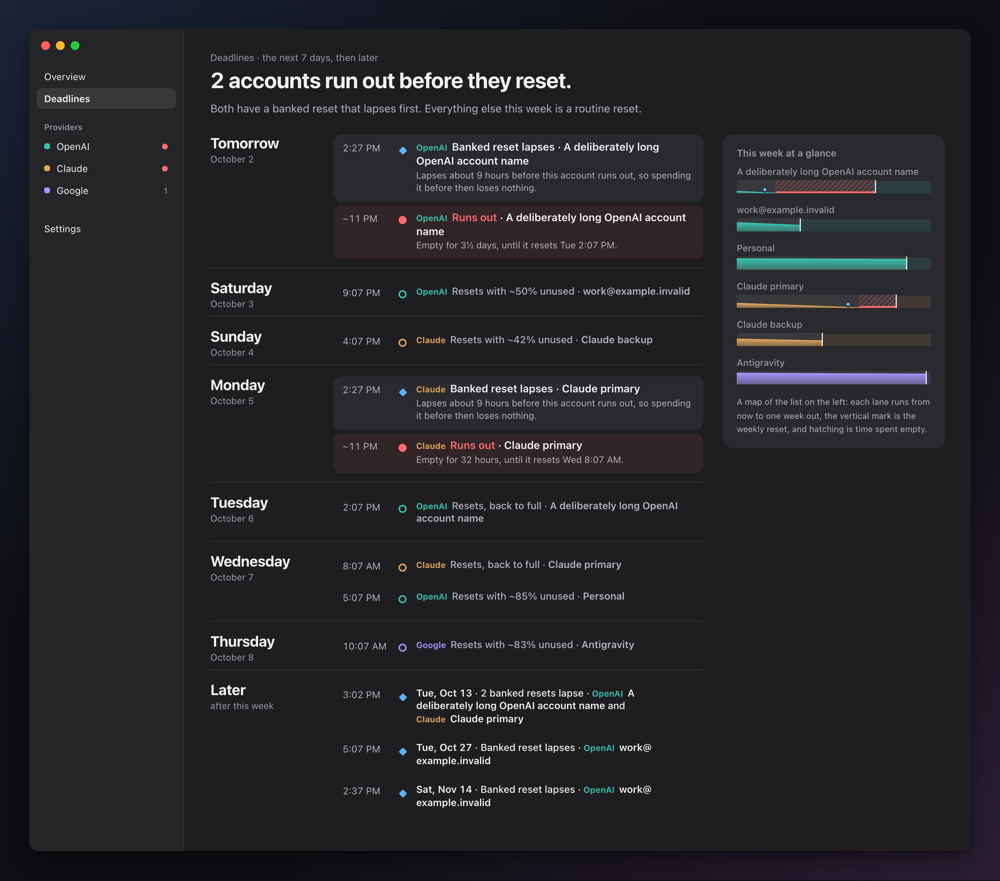
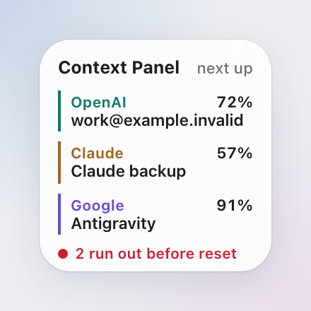
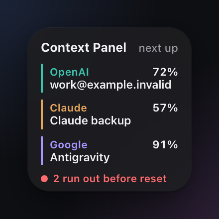
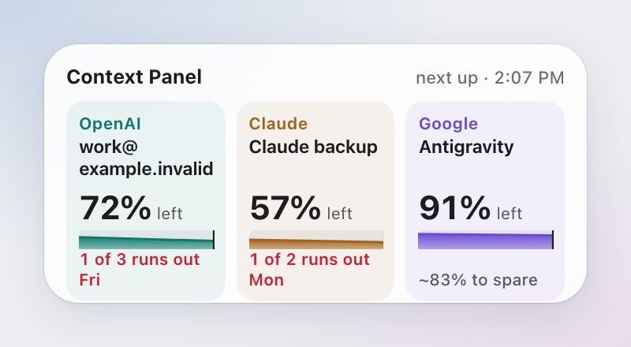
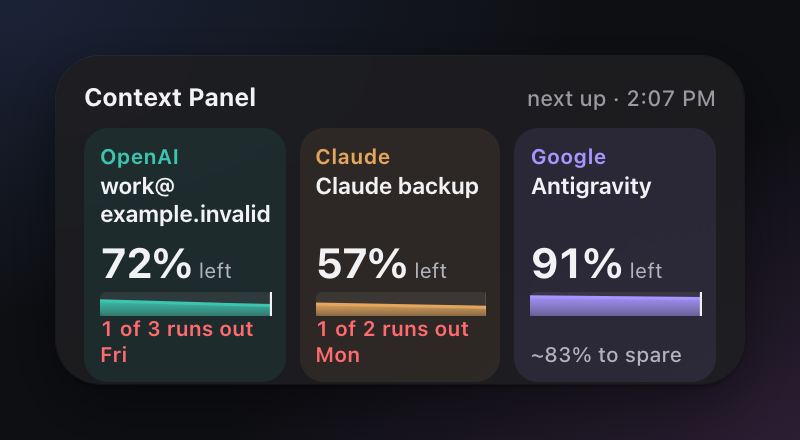
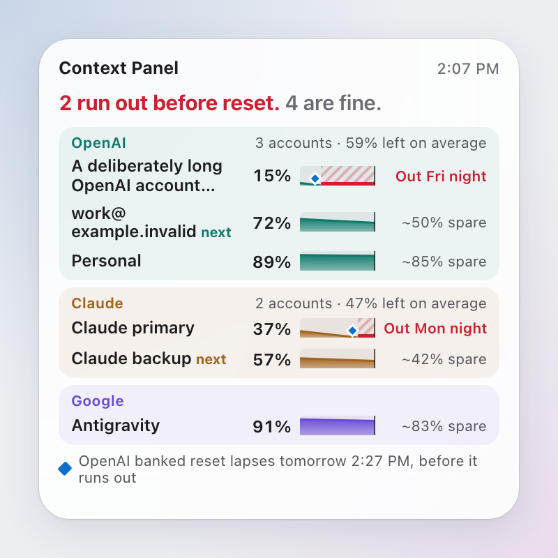
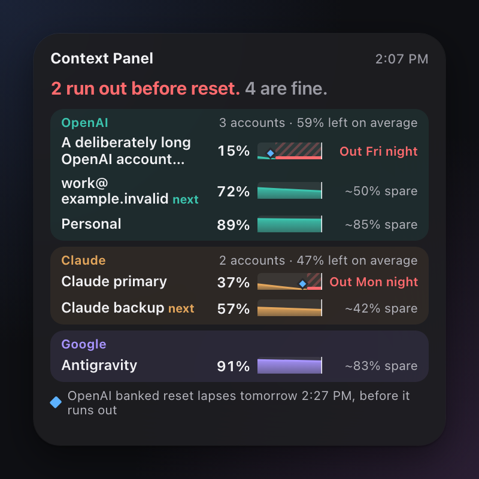

# Horizon (Claude Opus design exploration)

Static HTML/CSS mockups for issue #722, made for a three-model design comparison.
Nothing here is app code. Each page is self-contained: open it in a browser, and
add `?theme=light` or `?theme=dark` to force a theme. `index.html` links them all.

## Concept

1. Count in time, not percent: the question is whether an account gets to its reset.
2. Each account is one shape, the **horizon**: what is left now, draining at the observed pace toward the weekly reset.
3. If the shape reaches the reset mark, it is calm. If it hits empty first, the gap is hatched red. That is the only red.
4. Provider identity is the provider's name plus its own hue (teal OpenAI, ochre Claude, violet Google), used for group tints and the horizon fill. No logos and no letter badges.
5. Every surface leads with one sentence and one "use next" account per provider. Numbers come second.

## Surfaces

| Surface | Light | Dark |
|---|---|---|
| Mac overview |  |  |
| Mac Deadlines |  |  |
| Widget, small (164 × 164 pt) |  |  |
| Widget, medium (344 × 164 pt) |  |  |
| Widget, large (344 × 344 pt) |  |  |

PNGs are headless Chromium renders of these pages at 2×, through Playwright,
with the light or dark colour scheme emulated. Widget sizes match the #737
renderer. The desktop gradient behind each one is only there to show context.

## Data

These mockups use the same six synthetic accounts as #737's
`Tools/ContextPanelSharedViewRenderer`, at its pinned time, Thu Oct 1 2026 2:07 PM.
Every derived value comes from those rows: weekly % left, reset times, observed
weekly burn, 5-hour windows, banked expiries, and "Personal" being saved for last.

- Run-out time is % left divided by observed burn per hour. Two accounts run out before they reset: "A deliberately long OpenAI account name" tomorrow around 11 PM (reset Tue 2:07 PM), and "Claude primary" Mon around 11 PM (reset Wed 8:07 AM).
- "To spare" is the % expected to be left when the reset comes (for example, work@: 72 − 0.4 × 55 h ≈ 50%).
- "Use next" picks, within each provider, the account with the most to spare, skipping saved-for-last and short accounts.

## What I dropped on purpose

- **Pace multipliers and burn rates** (`3.6×`, `0.3%/h`). Their meaning is now in the shape's slope and two phrases: "~50% to spare" and "Runs out tomorrow night".
- **Amber, "close to limit", and green status dots.** Colour means one of two things: which provider it is, or red for "runs out before reset". Claude primary's 5-hour window at 22% is shown as a smaller ring, not as a warning, because it lasts until its refill.
- **NEXT / LAST pill badges.** The use-next account is named once per provider, and "Saved for last" is a quiet label.
- **Deadlines tiles, the 30-day timeline, and the This week / 30 days / Later regrouping.** Deadlines is now one day-by-day agenda in which each fact appears once, plus a small map of the week.
- **5-hour windows on Deadlines.** They refill within hours. The overview keeps them as a small secondary ring.
- **Exact minutes on estimates.** Run-outs say "~11 PM" or "tomorrow night". Real resets and banked expiries keep their exact minutes.
- **Combined burn and pace per provider.** What stays per provider is "59% left on average · 1 of 3 runs out before reset". The average treats every account as equal-sized and is labelled "on average", because #737's review found that plan sizes are unknown.

## Calls I made without asking

- The widget header is "Context Panel", as recommended in #722.
- A banked reset that lapses before its account runs out is called out as "spending it before then loses nothing". That is the one place the design comes close to advice. It follows the existing direction for actionable banked-reset copy ("use now / by <date>").
- The horizon assumes the observed weekly pace continues. Accounts without an observed burn would show a flat bar labelled "measuring" (not mocked here).
- In widgets, names wrap to two lines before they truncate. The large widget still ends the deliberately long name with "…" on line two. The app always shows names in full.
- Every row and column links to its account (`contextpanel://account/<id>` in the widget mockups), matching #722's clickable-areas finish line.

## My own 3-second glance check

I looked at each render cold for about three seconds and wrote down what I could
answer.

| Surface | Main question | Result |
|---|---|---|
| Widget, small | Am I OK? Which account next? | **Pass.** "2 run out before reset" in red at the bottom, and one named account per provider with its %. It does not say *which* two run short; that is one tap away. |
| Widget, medium | Same | **Pass.** Three provider columns, each with a big name and %, and a red line under OpenAI and Claude saying which day one of theirs runs out. |
| Widget, large | Same | **Pass.** The first line is the verdict. Red rows and hatched shapes stand out in under a second, and "next" sits inside each provider group. Weakness: the "spare" column is grey and easy to skip, which is intended. |
| Mac overview | Same, plus what runs out before it resets | **Pass.** The headline answers it, the three cards name the next account, and the two red-tinted rows with hatched gaps name the short accounts. The horizon needs about one look at the legend the first time. |
| Mac Deadlines | What runs out before it resets? | **Pass.** The headline plus two red cards, Fri and Mon. The banked-lapse card directly above each one explains the fix. |

Residual risks: the horizon is a new visual idiom, so it should be checked with a
real first-time user; the ochre Claude hue sits nearest to red; and hatching must
survive Increase Contrast and colour-blind filters. Hatching plus the words
"Runs out" carry the meaning without hue.
