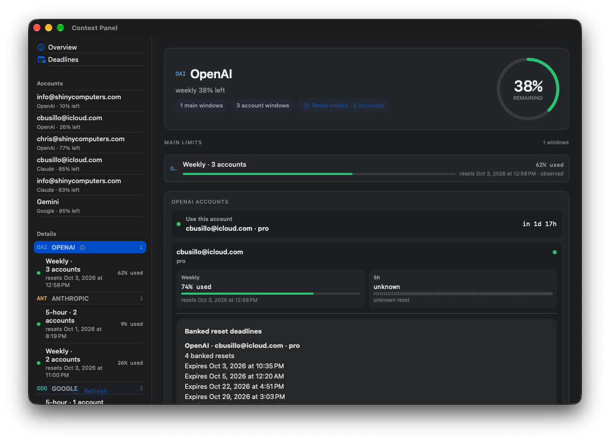
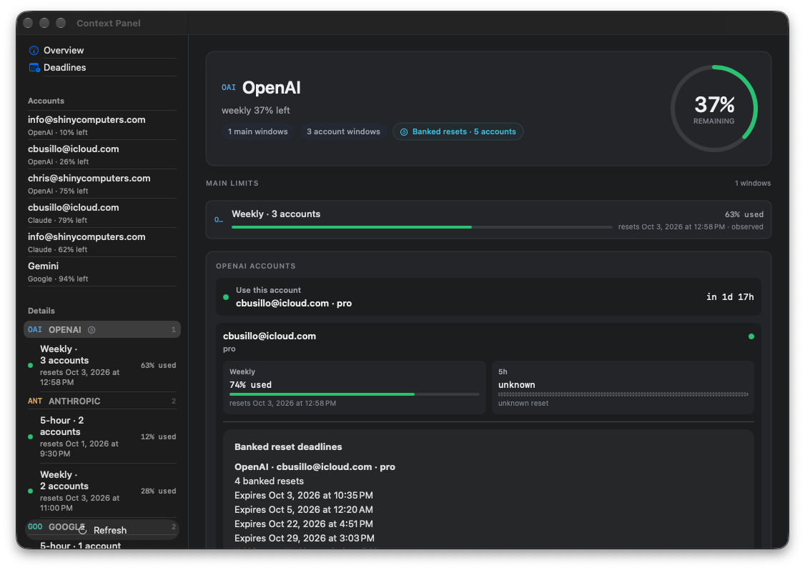
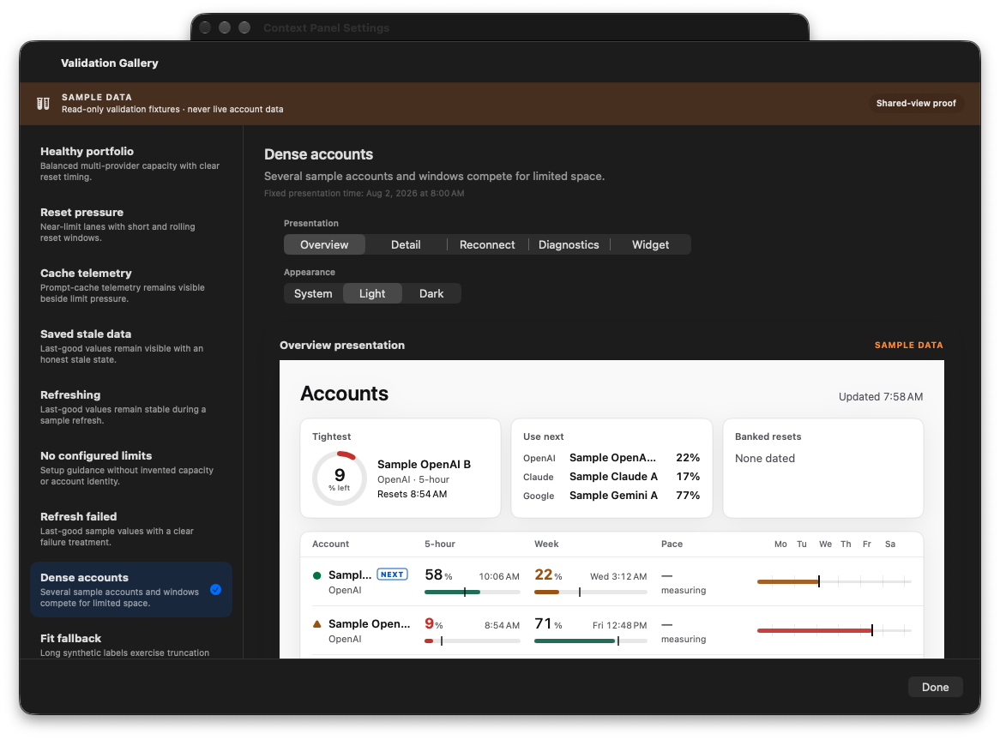
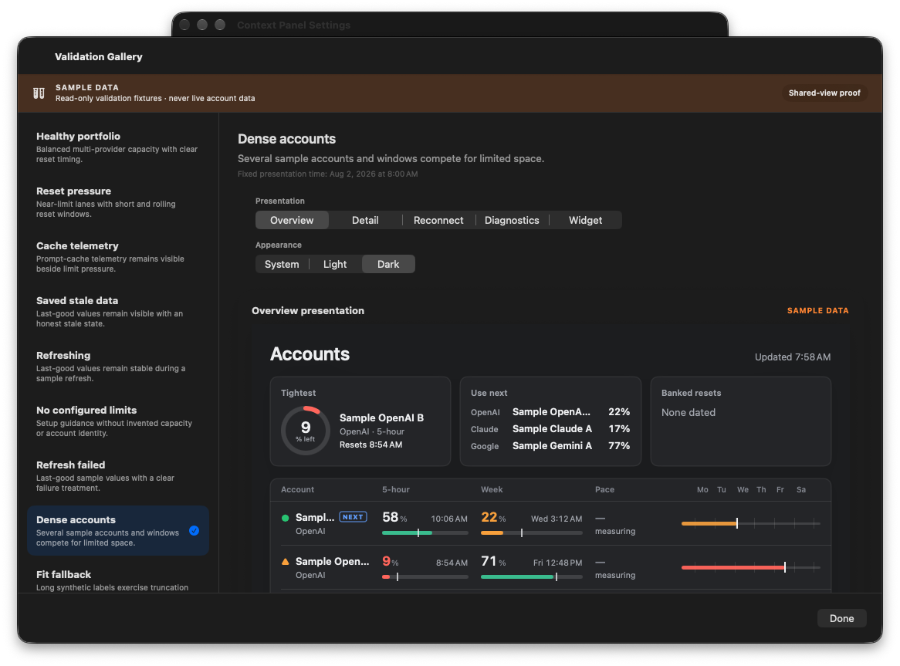
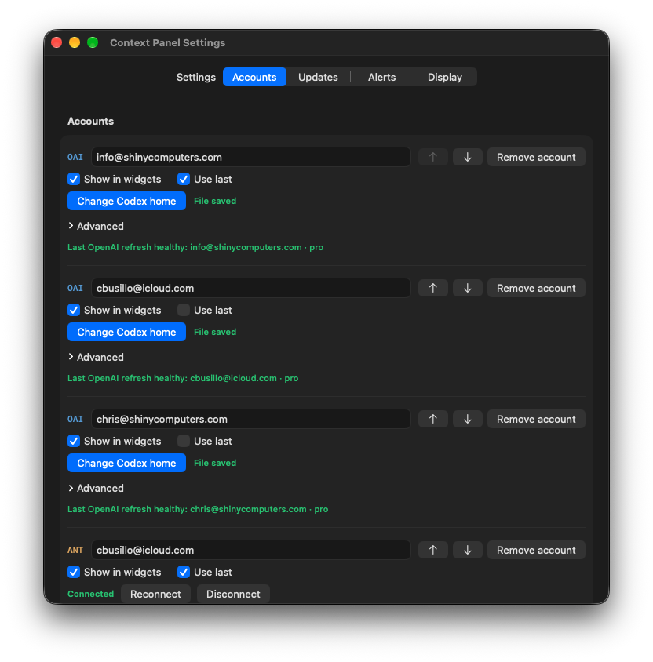
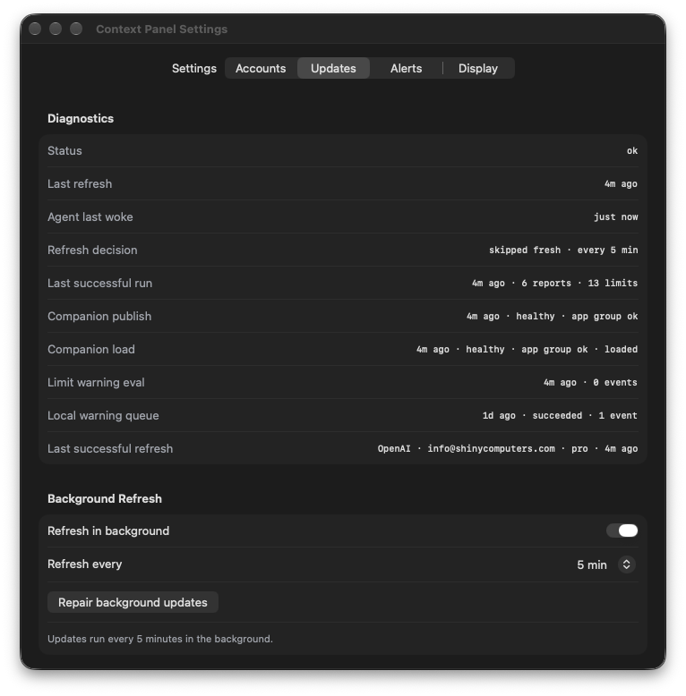

# Retained detail contrast check

Captured only Context Panel windows from the canonical signed app, at normal main-window size (1080 × 752 points). These are native captures, not HTML mockups. The shared-view galleries use sample data; the provider view shows the running app’s configured accounts. No credentials are included.

The before capture is app source `030d0db`; after is `696b1294ca83a366f56c5c5f2698959dbf91b904`, version 1.0.69 build 202610020045. The displayed observations changed between captures; this is a readability comparison, not a provider-value comparison.

| Before | After |
| --- | --- |
|  |  |

The captured display has a SAMSUNG ICC profile. Full ink/background pixels were converted from that embedded profile to sRGB before applying WCAG relative luminance. Before: `(40,88,171)` on `(40,45,57)`, **2.016:1**. After: `(92,205,236)` on `(42,48,53)`, **7.248:1**. Antialiased edge pixels were not used as the text color. Source light-card contrast is **4.69:1** at rest and **4.57:1** at the hover tint; hover values are calculated, not a captured hover interaction.

The retained forecast preview also uses the shared text accent instead of the dark button fill. Visible reset labels and their app spoken labels now share banked-reset terminology; a follow-up is needed for the remaining legacy widget/provider vocabulary noted in the review.

| Shared native view: light | Dark |
| --- | --- |
|  |  |

These gallery captures establish the current light/dark presentation, not Horizon implementation or physical companion acceptance. The newer owner decision selects Horizon (#739), borrowing two Clear Skies elements; that integration follows this functional contrast check. Existing detail and Settings remain available.

Production baseline and companion cache preflight passed after install, with the canonical app, widget and refresh agent registered. Settings → Updates verified background refresh **ON**, every **5 min**. No data reset, entitlement change, widget placement reset or global appearance change.

Anthropic `claude-opus-5-5` reviewed the focused source diff read-only. It confirmed the contrast repair and unchanged counts/expiry calculations. Its first wording findings were addressed in the retained account card and no-guidance spoken token. Further legacy visible/spoken terms, a provider-count qualifier, and a potential dark tinted-link issue remain recorded for the Horizon integration; these captures do not claim those are resolved.

## Final functional follow-up

Source `516e97f29dd5a9bd602680e313301163f60fe09e`, version 1.0.69 build **202610020115**, also aligns the remaining retained app/widget labels, singular count grammar, provider-specific hint and mixed-provider spoken qualifier. The new mixed-provider behavioral regression fails with the old qualifier and passes with the fix. The full gate passes **1,118 Swift tests**. Anthropic `claude-opus-5-5` found no actionable regression in this focused follow-up. Its optional literal-string-pinning suggestion was declined under the repository’s test rules; fallback widget wording and the authorization link are not claimed as screen-tested. No sign-in/browser flow was started.

The final candidate was verified, installed at the canonical path and inspected at normal Settings size. The banked-tag palette is unchanged from the measured contrast repair above. The source-bound app fingerprint is `ad54e9b6724cf07b42103c997cc5e186bf14d26488f10a965957611d02c47c5f`; ZIP SHA-256 is `613de1b7c8a4a207c1ee7787ea2abb7f0abcd908964b7c8f12b1ce352da0441d`. All three signatures and unchanged entitlements verify, with Production CloudKit for the app and agent; runtime baseline and companion cache preflight pass.

| Accounts at normal size | Background refresh after install |
| --- | --- |
|  |  |

Three complete account rows fit, with the next row visible; the account list scrolls vertically. Names, ordering, removal and connection actions fit the pane. These captures do not demonstrate the previously unverified expanded Advanced disclosure. Background refresh was restored and verified ON at five minutes before the Mac locked. The foreground guard then stopped an additional legacy-view check; no blind input, unlock attempt or further preference change was made. The helper remained running and a fresh read-only Production baseline and companion cache preflight passed after the lock.

Horizon is owned by draft #741. This functional lane did not commit its temporary overlapping Horizon prototype. The reproduced #741 missing-reset false-reassurance defect is recorded on #722 at comment 5943582956; pending Horizon integration and physical/hand acceptance remain separate from this candidate.
