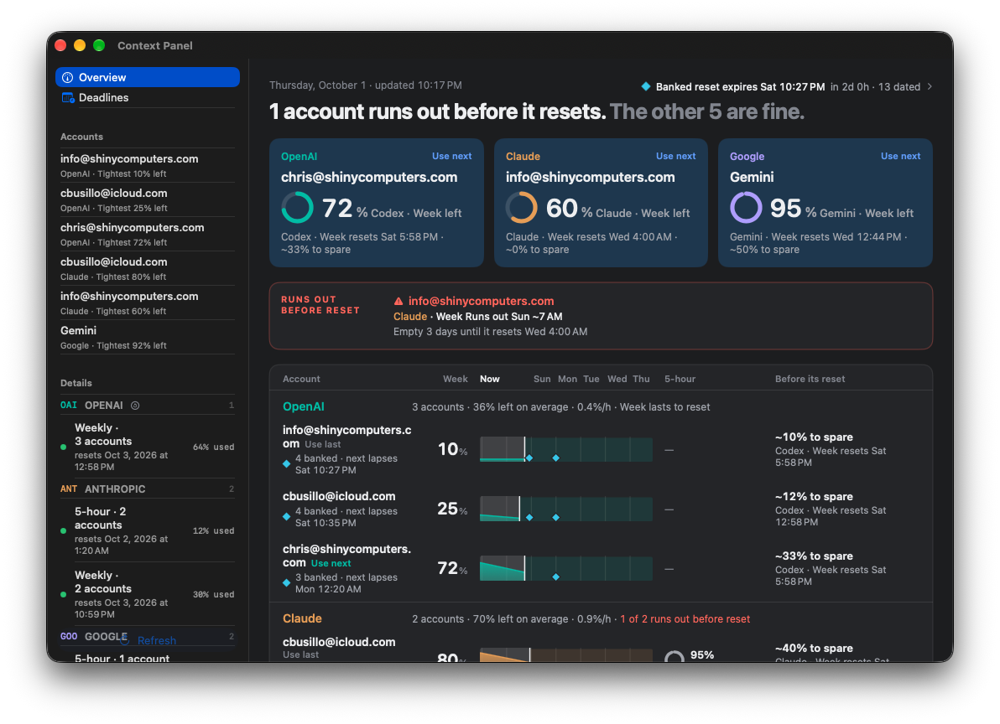
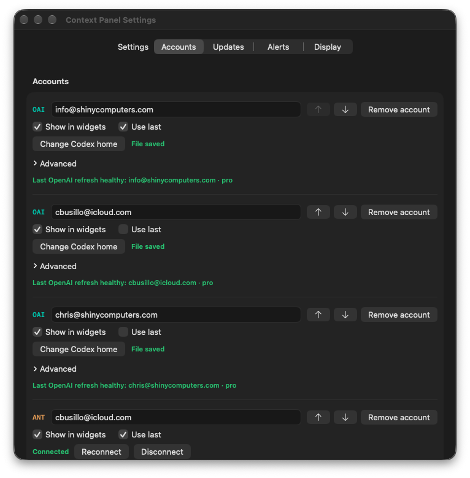
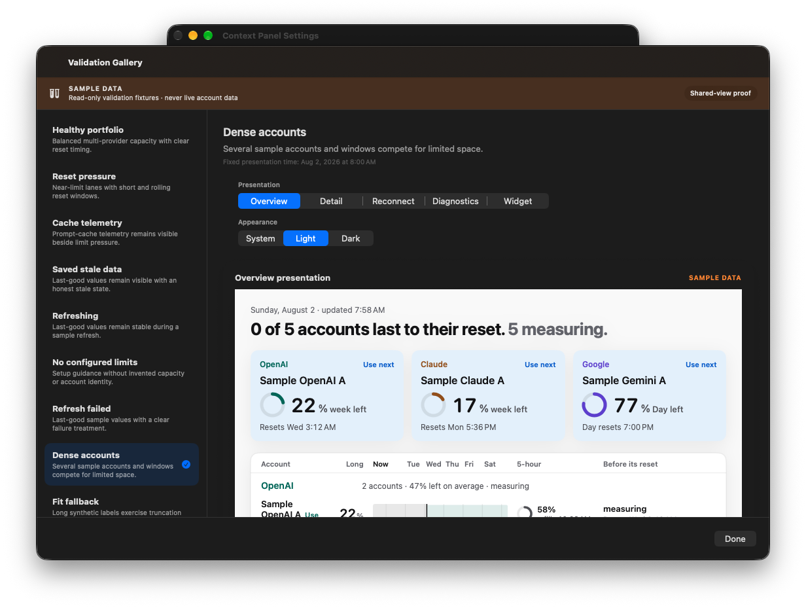
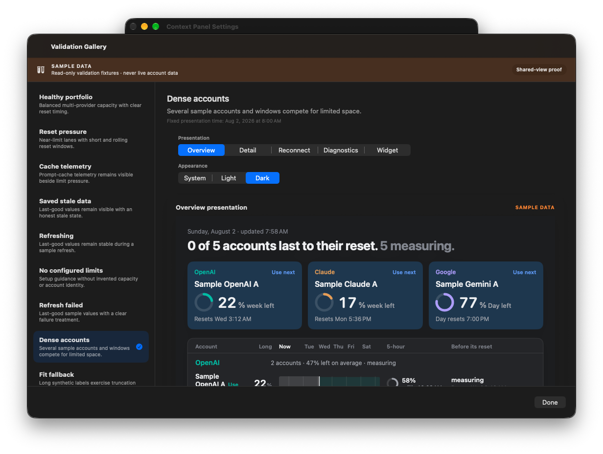
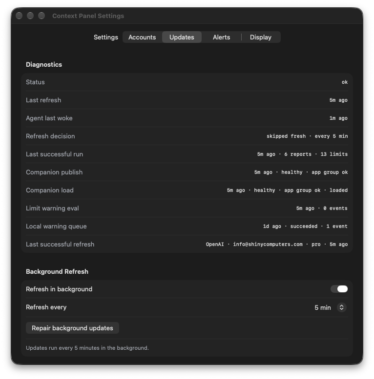

# Canonical Horizon inspection

Native window captures from `/Applications/Context Panel.app`; no worktree bundle was launched. The live overview and Settings use the configured accounts; gallery captures use explicitly marked sample data. No credentials are included. Provider observations changed during the pass, so these are presentation evidence, not byte-identical quota comparisons.

Final installed app source: `384f428ca98fbf9e64379f2503cd2f06d332f10d`, 1.0.69 build **202610020400**. App fingerprint `03c482527643f3522098762354d57f763cf7931d51ab7ee0d89b6b5cba58e952`; ZIP SHA-256 `a24e7358f8f09017618a9f5161a73e18c9bb02c170d248bea15b3510f3b25e04`. App, widget and agent signatures verify, their entitlements equal the predecessor, and app/agent use Production CloudKit. No data or widget-placement reset.

| Overview at 1080 × 752 points | Settings at 720 × 732 points |
| --- | --- |
|  |  |

The overview scrolls vertically for the lower provider groups. Settings shows three complete account rows, with the next row visible, readable names and ordering/removal/connection controls. Expanded Advanced remains unverified. The screenshot shows existing Use last preferences; they were not changed. No live account was removed.

The sidebar's percentage now says **Tightest**, distinguishing it from an explicitly weekly card. Values and window/model labels are unchanged. A callout that already starts with the provider name no longer repeats that same prefix. Native inspection verifies the observed Claude duplication is gone; distinct model labels remain. The Use next rule is unchanged while the owner question is pending.

| Native sample-data view: light | Dark |
| --- | --- |
|  |  |

These gallery captures are from `c730660`, with the same final palette; the final wording follow-up changes no color token. Google violet text passes AA on actual captured card backgrounds. The embedded SAMSUNG ICC profile was converted to sRGB before calculating relative luminance, using full-ink pixels rather than antialiased edges:

- Live dark card: `(184,168,255)` text on `(38,63,89)`, **5.204:1**.
- Native light gallery card: `(106,75,214)` text on `(232,242,252)`, **5.163:1**.

The darker gallery host surrounds the intentionally light preview; it is not a global system appearance change. No color correction was needed. The older retained banked-reset tag repair (2.02 → 7.25:1) remains in this source; its before/after record is in `../722-contrast/`.

Background refresh was restored after each install and verified **ON / 5 min** in Settings after each capture pass. The app/widget/helper paths and URL handler are canonical. A prior c730660 Production baseline/cache preflight passed. The first final-source receipt correctly failed because CI was actively generating unsigned companion bundles in its validation root; those active files were preserved. After CI finished its bounded cleanup, the fresh final Production baseline reports baseline=OK and companion preflight=OK (zero generated bundles). All four exact-head checks on 384f428 are green. The earlier failed transient receipt remains recorded; it was not called a pass.

The functional TV follow-up passes each account's deadlines through the focusable card into TVAccountTile, matching the board's banked diamonds. A real tvOS Release archive succeeds and its gallery-isolation check passes. The helper quarantines its own generated companion bundles. No physical TV behavior is claimed from the archive.

Both focused changes pass the full gate with **1,132 Swift tests**. Anthropic **claude-opus-5-5** found no defects in TV routing and no actionable regression in the wording change. Its redundant-filter nit was declined because the card receives account-scoped data. The wording review's Codex-trigger example and claim that VoiceOver simply reads the new caption were inaccurate: the observed duplicate was Claude, and the sidebar retains its existing account accessibility override. The actual prefix check and unchanged spoken summary were inspected directly. The optional unknown-caption cosmetic suggestion was deferred; unknown values retain the existing dash.

OpenAI **gpt-6.1-sol** reviewed the original Horizon implementation; its earlier findings/decisions remain in #741. The reproduced missing-reset false-reassurance defect is fixed and its standalone synthetic readback gives lasting=0/measuring=1. This evidence does not approve the pending Use next decision, copied publisher identity, unverified feed pooling, legacy retirement, hand acceptance, physical companions, or a release.
